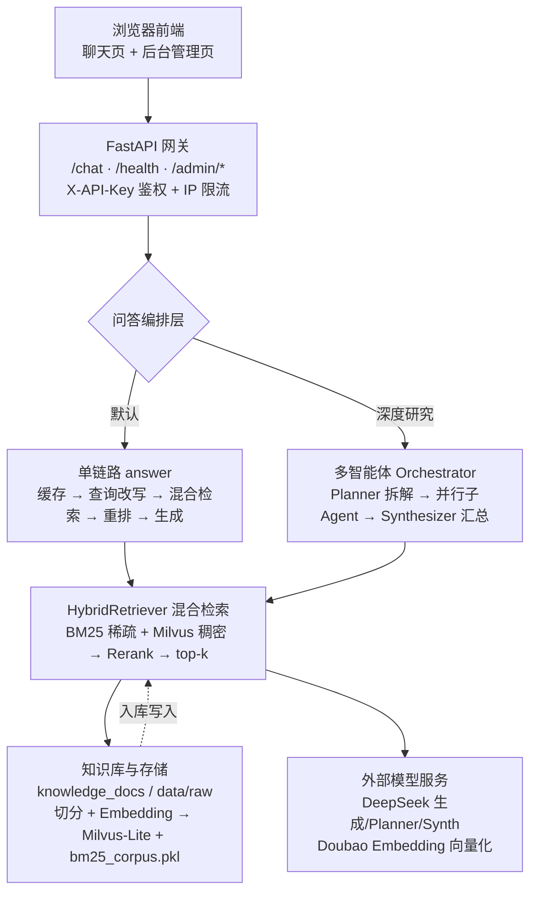

# 个人 RAG 知识库问答系统 · 技术教学文档（teach.md）

> 本文档面向想理解本项目「用了什么技术、怎么实现、为什么好」的读者。配合架构图与分阶段拆解，可作为技术分享或面试讲解底稿。
> 配套代码：`src/`（后端）、`frontend/`（前端）、`config/settings.yaml`（集中配置）、`knowledge_docs/`（技术详解）。

---

## 一、项目概览

这是一个**基于 RAG（检索增强生成）的个人知识库问答系统**：把个人简历、项目文档等资料向量化入库，用户提问时先检索最相关资料，再交给大模型生成答案。

技术选型原则：**轻量、可单机部署、易维护、零多余依赖**。整体由四部分构成：

- 前端：原生 HTML/CSS/JS，FastAPI 同源托管
- 后端：FastAPI 异步接口 + 多智能体编排
- 检索：BM25 稀疏 + Milvus 稠密混合检索 + 重排序
- 模型：DeepSeek 生成、火山方舟 Doubao Embedding 向量化

---

## 二、架构总览

### 架构图（Mermaid）

### 分层说明

| 层 | 职责 | 关键技术 |
|----|------|----------|
| 前端展示层 | 用户交互、主题、对话 UI | 原生 HTML/CSS/JS、玻璃拟态、磁吸、卡片式对话 |
| API 网关层 | 路由、鉴权、限流、跨域 | FastAPI、Pydantic、CORS、X-API-Key、IP 限流 |
| 问答编排层 | 决定单链路还是多智能体 | 语义缓存、查询改写、Orchestrator（Planner/子Agent/Synthesizer） |
| 检索核心层 | 召回相关资料 | BM25、Milvus-Lite、RRF 融合、BGE Reranker |
| 数据 & 模型层 | 资料入库与模型调用 | 切分、Doubao Embedding、Milvus-Lite、DeepSeek |

---

## 三、分阶段技术详解

### 阶段 1：前端展示层

**用到技术**：原生 HTML / CSS / JavaScript（零框架）、三态主题（light/dark/system）、玻璃拟态（glassmorphism）、磁吸按钮、卡片式对话、极光背景。

**怎么实现**
- 三态主题：主题值存 `localStorage`，切换时给 `<html>` 设 `data-theme` 属性，CSS 用变量适配；`system` 模式用 `matchMedia` 实时跟随系统。
- 玻璃拟态：元素用半透明背景 + `backdrop-filter: blur()` + 1px 半透明边框，呈现磨砂质感。
- 磁吸按钮：监听 `mousemove`，按光标相对按钮中心偏移做 `translate`，离开时复位，提升触感。
- 卡片式对话：每条消息是一个「头像 + 名字 + 时间 + 气泡」卡片，用户与 AI 左右镜像。
- 极光背景：纯 CSS 渐变 + 动画，无图片依赖。

**优点**
- 零构建步骤、零前端依赖，直接由 FastAPI 静态托管，部署极简。
- 加载快、可控性强，所有交互（主题/磁吸/卡片）都能在面试中讲清楚「为什么这么做」。
- 不引入 React/Vue 等框架，避免和后端打包耦合，适合个人作品集。

---

### 阶段 2：API 网关层

**用到技术**：FastAPI、Pydantic、CORS 中间件、`X-API-Key` 鉴权、IP 限流、Uvicorn（ASGI 服务器）。

**怎么实现**
- 所有接口挂在 FastAPI 上：`/chat`（问答）、`/health`（健康检查）、`/admin/status`、`/admin/upload`、`/admin/ingest`（后台管理）。
- 请求/响应用 Pydantic 模型（`ChatReq`/`ChatResp`）做类型校验。
- 鉴权：所有接口依赖 `get_api_key`，要求请求头带合法 `X-API-Key`。
- 限流：`rate_limit` 按客户端 IP 计数，超限返回 429。
- 跨域：生产可把 `allow_origins` 收紧到前端域名。

**优点**
- 异步框架，单进程即可扛高并发问答请求。
- Pydantic 提供类型安全与自动 OpenAPI 文档，接口自解释。
- 鉴权 + 限流内置，直接挡掉未授权与刷接口行为，上线即安全。

---

### 阶段 3：问答编排层

**用到技术**：语义缓存（可关）、查询改写、单链路生成、**多智能体 Orchestrator**（Planner / 并行子 Agent / Synthesizer）。

**怎么实现**
- 单链路 `answer()`：先查语义缓存 → 查询改写 → 混合检索 → 重排 → 大模型生成。
- 多智能体 Orchestrator（深度研究模式，前端开关触发）：
  1. **Planner**：调一次 LLM 把复杂问题拆成 ≤3 个子问题（JSON 输出，解析容错）。
  2. **并行子 Agent**：用 `asyncio.gather` + `asyncio.to_thread` 并发跑每个子问题，直接复用现有 `answer()`（检索+生成），单个子问题失败跳过、全失败退回单链路。
  3. **Synthesizer**：把各子答案汇总成完整回答；LLM 调用失败则用规则拼接兜底。
- 子问题列表透传给前端，展示「思维链」。

**优点**
- 单链路保证日常问答简单、快、零额外开销。
- Orchestrator 让「介绍整个项目」这类跨文档综合问题能被拆解到不同资料块再汇总，答案更完整。
- 全程优雅降级：子 Agent 失败不拖垮整体，LLM 限流时仍有答案。

---

### 阶段 4：检索核心层

**用到技术**：BM25 稀疏检索、Milvus-Lite 稠密向量检索、RRF 倒数排名融合、BAAI/bge-reranker-v2-m3 重排序。

**怎么实现**
- 稠密检索：Embedding 模型把问题和段落编码成 1024 维向量，在 Milvus-Lite 做 L2 最近邻搜索，擅长语义相似。
- 稀疏检索：BM25 关键词匹配，对专名/缩写/编号敏感；入库时生成 `bm25_corpus.pkl` 倒排语料。
- RRF 融合：`score = Σ 1/(k + rank)`（k=60），只取排名不取分数，鲁棒融合两路候选。
- 重排：融合候选交给跨编码器 BGE Reranker 精排，把真正相关段落顶到前面。
- Top-K：`top_k_retrieve=20`（每路先召回 20），`top_k_final=8`（送进 LLM 的段落数）。

**优点**
- 混合检索互补：向量解决「语义近但词不同」，BM25 解决「术语精确命中」，是工业界 RAG 标配。
- RRF 不依赖分数量纲统一，融合稳定。
- 重排比双塔向量更准，显著提升送进 LLM 的上下文质量。
- `top_k_final` 从 4 提到 8 是一次关键优化：相关段落覆盖率从 66.7% → 100%（小语料），扩到 37 块语料后 38.0% → 65.0%（+71.1%），检索耗时几乎不变。

---

### 阶段 5：数据 & 模型层

**用到技术**：知识库（`knowledge_docs`/`data/raw`）、文本切分（chunking）、火山方舟 Doubao Embedding、Milvus-Lite、BM25 语料（pickle）、DeepSeek（`deepseek-chat`）。

**怎么实现**
- 入库：读取资料 → 按 500 字符、重叠 80 切分 → Doubao Embedding 向量化 → 写入 Milvus-Lite（集合 `personal_rag`，`dense_vec` 1024 维，L2）→ 落盘 `bm25_corpus.pkl`。
- 向量库：Milvus-Lite 是嵌入式单文件方案（`milvus_lite.db`），随应用进程运行，无需独立数据库服务。
- 生成：DeepSeek 经 OpenAI 兼容接口调用，`temperature=0` + 强制「严格仅依据资料」约束；`max_tokens=4096` 防止长答案被截断。
- 文件锁：Milvus-Lite 单进程持有写锁，跑评估/benchmark 前需停服释放。

**优点**
- Milvus-Lite 把向量库运维成本降到零，最契合腾讯云小机型与单机部署。
- Doubao Embedding 1024 维与本地 Ollama 一致，Milvus schema 通用，本地/云端可切换。
- `temperature=0` + 严格约束让答案稳定、不编造；`max_tokens` 保证长回答完整。
- 配置集中（`settings.yaml`）、密钥走环境变量（`.env`），改超参不动代码。

---

## 四、一次「深度研究」问答的完整数据流

以「介绍你整个项目的技术架构与部署方式」为例：

1. 前端勾选「深度研究」→ 请求带 `deep: true` 发到 `/chat`。
2. `orchestrate()` 调 **Planner**：拆出子问题，如「技术栈是什么」「检索怎么实现」「如何部署」。
3. 每个子问题作为独立子 Agent，**并行**跑 `answer()`：各自检索 → 重排 → DeepSeek 生成子答案。
4. **Synthesizer** 把三个子答案汇总成完整、连贯、带文件名引用的终答。
5. 后端返回答案 + 去重来源 + 子问题列表；前端展示答案并附「思维链」标签。

---

## 五、技术选型速查表

| 技术 | 阶段 | 实现要点 | 优点 |
|------|------|----------|------|
| 原生 HTML/CSS/JS | 前端 | 零框架、FastAPI 同源托管 | 零构建、轻量、可控 |
| FastAPI + Pydantic | 网关 | 类型校验、自动 OpenAPI | 异步高并发、接口自解释 |
| X-API-Key + IP 限流 | 网关 | 请求头鉴权 + 按 IP 计数 | 上线即安全 |
| 多智能体 Orchestrator | 编排 | Planner 拆解 → 并行子 Agent → Synthesizer | 跨文档综合问题答案更完整 |
| BM25 + Milvus 混合 | 检索 | 双路召回 + RRF 融合 | 语义与术语互补 |
| BGE Reranker | 检索 | 跨编码器精排 top 候选 | 送进 LLM 的上下文更准 |
| Milvus-Lite | 存储 | 嵌入式单文件向量库 | 零运维、契合小机型 |
| Doubao Embedding | 模型 | 1024 维向量化 | 本地/云端 schema 通用 |
| DeepSeek | 模型 | OpenAI 兼容接口、temp=0、max_tokens=4096 | 稳定、不编造、长答案完整 |

---

## 六、小结

本项目用一套「轻量但完整」的技术栈，跑通了从**资料入库 → 混合检索 → 多智能体编排 → 大模型生成**的全链路，并兼具：
- **质量可量化**：确定性「相关段落覆盖率」指标，优化效果可复现；
- **架构可扩展**：单链路 + 多智能体双形态，复杂问题自动拆解；
- **部署可运维**：systemd 常驻、配置集中、密钥分离。

适合作为「全栈 + RAG + 多智能体」能力的作品集展示。
